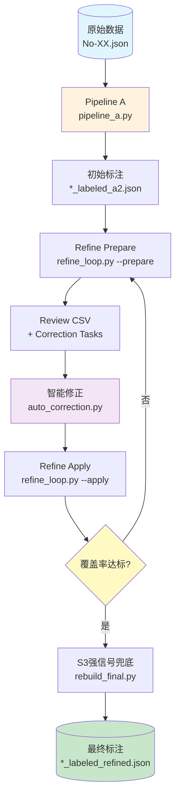

# 心理咨询对话三级标签自动标注系统

基于传统 NLP + 机器学习方法，对心理咨询对话进行 **S1 / S2 / S3** 三级分类标注。

- **S1 — 日常困扰（轻度心理不适）**：学业、职场、家庭矛盾、失眠、压力、社交等 17 个子类
- **S2 — 中度心理障碍**：抑郁、焦虑、双相、PTSD、饮食障碍、强迫等 9 个子类
- **S3 — 紧急危机**：正在自杀、自杀计划、自残、伤害他人、报复等 5 个子类

数据来源：`psy525` 心理咨询平台真实问答对话（3份，各8366条）。

---

## 技术栈

- **分词**：jieba
- **特征提取**：TF-IDF（1-3gram，sublinear tf）
- **分类器**：LogisticRegression（多分类，max_iter=1000）
- **启发式基线**：关键词匹配（S3→S2→S1 优先级覆盖）
- **自动修正**：启发式共识 + 低置信度替换 + S3强信号兜底

---

## 流程示意图



---

## 项目结构

```
data-annotation/
├── data/                           # 数据目录
│   ├── No-01.json                  # 原始未标注数据
│   ├── No-01_labeled_a2.json       # 初始自动标注结果
│   ├── No-01_labeled_refined.json  # 最终精炼标注结果
│   ├── No-02.json                  # （同上）
│   ├── No-02_labeled_a2.json
│   ├── No-02_labeled_refined.json
│   ├── No-03.json
│   ├── No-03_labeled_a2.json
│   └── No-03_labeled_refined.json
├── pipeline_a.py                   # 思路A: 批量自动标注主流程
├── generate_review.py              # 生成不确定样本审核 CSV
├── prepare_correction_tasks.py     # 从审核 CSV 生成修正任务
├── auto_correct.py                 # 用 LLM (DeepSeek) 自动修正标签
├── auto_correction.py              # 启发式自动修正（无需 API）
├── refine_loop.py                  # 两阶段自动修正循环
├── merge_corrections.py            # 合并多个子代理修正结果
├── retrain.py                      # 人工修正后加权重训
├── rebuild_final.py                # 一键重建最终标注
├── GIT_WORKFLOW.md                 # Git 工作流规范
├── .gitignore
└── README.md
```

---

## 脚本说明

### `pipeline_a.py` — 批量自动标注

处理 `data/` 下所有 `No-*.json`（排除已标注的）。

流程：加载 → 预处理（去重）→ 启发式关键词标注 → TF-IDF 向量化 → LogisticRegression 训练预测 → 输出 `*_labeled_a2.json`

```bash
python pipeline_a.py
```

### `generate_review.py` — 生成审核 CSV

训练模型后，按置信度排序选出最不确定的样本，供人工/LLM 审核修正。

```bash
python generate_review.py --data data/No-01.json --n 500
```

### `prepare_correction_tasks.py` — 生成修正任务

从 review CSV 生成 JSON 格式修正任务。

```bash
python prepare_correction_tasks.py --data data/No-01.json --review data/No-01_review.csv
```

### `auto_correct.py` — LLM 自动修正（需 DeepSeek API）

```bash
export DEEPSEEK_API_KEY=sk-xxx
python auto_correct.py --input data/No-01_review.csv --data data/No-01.json --output data/No-01_corrections.json
```

### `auto_correction.py` — 启发式自动修正（无需 API）

基于 S3关键词覆盖 + 低置信度启发式替换，自动生成修正标签。

```bash
python auto_correction.py
```

### `refine_loop.py` — 两阶段修正循环

**prepare 阶段**：训练模型 → 选取不确定样本 → 生成 review CSV + correction_tasks

```bash
python refine_loop.py --phase prepare --file No-01
```

**apply 阶段**：加载修正 → 加权重训 → 输出 refined JSON

```bash
python refine_loop.py --phase apply --file No-01 --corrections data/No-01_corrections.json --weight 15
```

### `rebuild_final.py` — 一键重建最终标注

从 `labeled_a2` 出发，执行完整修正链：生成修正 → 加权重训 → S3强信号兜底 → 输出最终结果。

```bash
python rebuild_final.py
```

---

## 标注结果

| 文件 | 类覆盖 | S3子类 | S1 | S2 | S3 |
|------|--------|--------|----|----|----|
| No-01 | **30**/31 | 全部5个 | 51.1% | 41.2% | 7.7% |
| No-02 | **31**/31 | 全部5个 | 50.8% | 41.4% | 7.8% |
| No-03 | **31**/31 | 全部5个 | 51.9% | 39.7% | 8.5% |

**改进 vs 初始基线：**

| 指标 | 初始 | 最终 |
|------|------|------|
| 类覆盖 | 15-16/31 | **30-31/31** |
| S3子类 | 2-3/5 | **5/5** |
| S3占比 | 1.2-1.8% | **7.7-8.5%** |

---

## 标签体系

| 层级 | 子类数 | 说明 |
|------|--------|------|
| **S3 紧急危机** | 5（3.1~3.5） | 自杀、自残、伤害他人等需立即干预 |
| **S2 中度障碍** | 9（2.1~2.9） | 抑郁、焦虑、PTSD、强迫等需要专业干预 |
| **S1 日常困扰** | 17（1.1~1.17） | 学业、职场、家庭、失眠、压力等生活话题 |

优先级规则：**S3 > S2 > S1**，选择最匹配的子类。

---

## 依赖

```bash
pip install jieba numpy scikit-learn
# auto_correct.py 额外需要: openai
pip install openai
```

---

## 修正策略

1. **S3关键词强覆盖**：含明确S3关键词（自杀、跳楼、割腕等）的样本强制标S3
2. **低置信度替换**：模型置信度 < 0.5 时改用启发式标签
3. **加权重训**：修正样本权重 x15，迫使模型学习稀有标签
4. **S3强信号兜底**：最终输出前对强S3信号样本做二次确认

---

## 备注

- `.gitignore` 已忽略 `venv/`、`__pycache__/`、`*.pyc`、锁文件及 `data/classify_p2.py`
- 数据从 `psy525` 心理咨询平台爬取，含完整问答对话
- 远程仓库：`git@github.com:Jared-Linn/data-annotation.git`
- 项目为课程项目（滇池学院理工学院 · NLP 方向）
